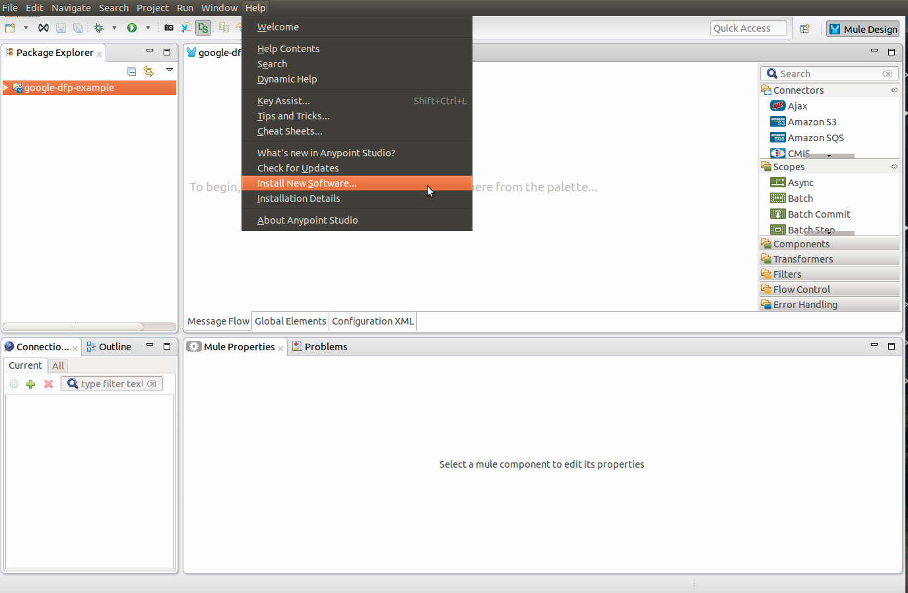
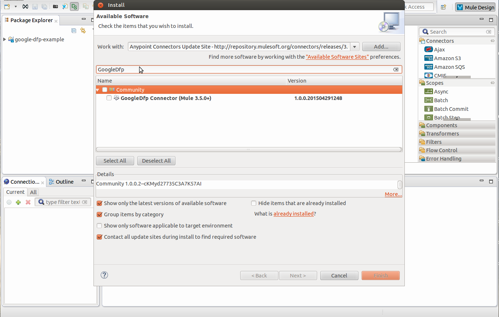
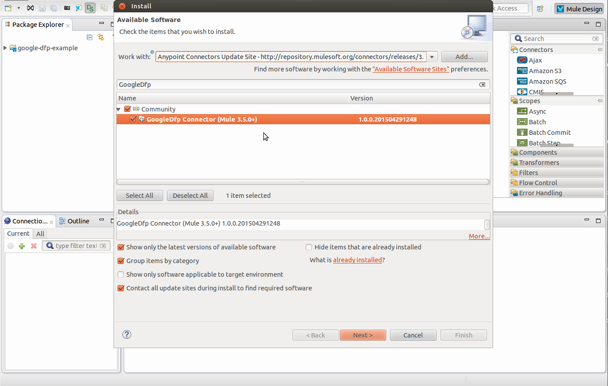
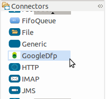
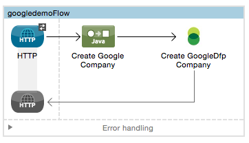
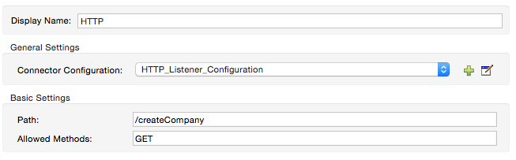
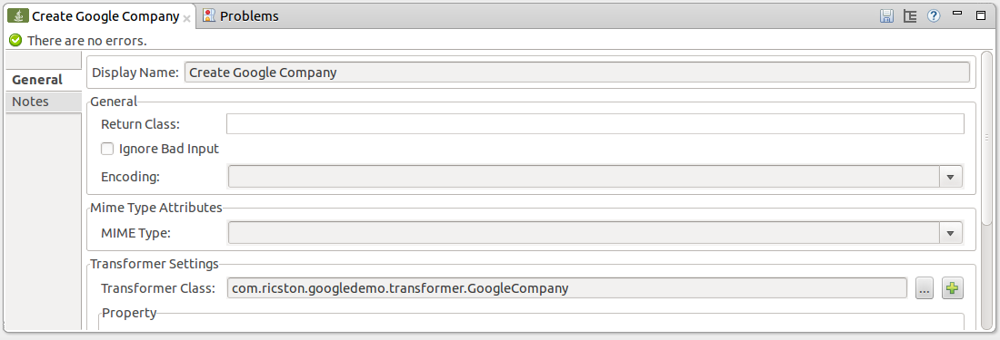
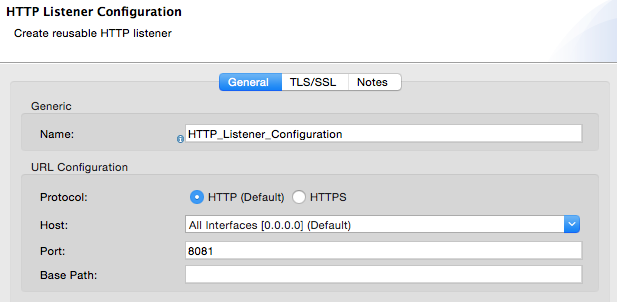
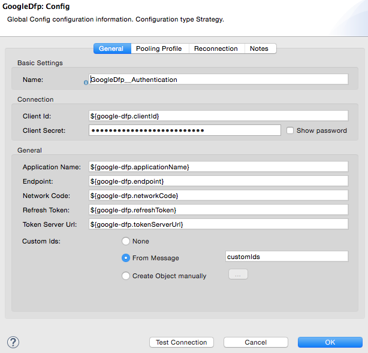
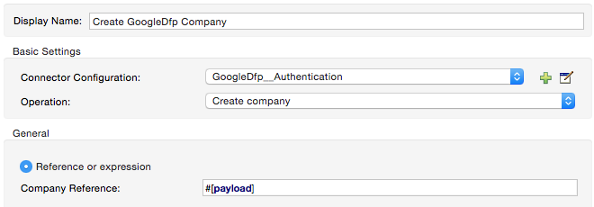

= Google DFP

Anypoint™ Connector for Google DFP enables publishers and third-parties to customize and extend the product to help them grow, sell, schedule, deliver, and measure all of their digital ad inventory.

---

== Contents:

. Introduction
.. Prerequisites
.. Requirements
.. Dependencies
.. Compatibility Matrix

. Installing & Configuring
.. Installing
.. Configuring

. Example Use Case
.. Anypoint™ Studio Visual Editor 
.. Anypoint™ Studio XML Editor
.. Example Code
---

== Introduction 

Google's DoubleClick for Publishers is a comprehensive hosted ad serving platform that streamlines your ad management functions and allows you to generate even-greater advertising margins.

It offers publishers a complete ad revenue engine, helping publishers streamline operations and capture the most value for every impression.

=== Prerequisites

This document assumes that you are familiar with Mule, http://www.mulesoft.org/documentation/display/35X/Anypoint+Connectors[Anypoint™ Connectors], and the http://www.mulesoft.org/documentation/display/35X/Anypoint+Studio+Essentials[Anypoint™ Studio interface]. To increase your familiarity with Studio, consider completing one or more http://www.mulesoft.org/documentation/display/35X/Basic+Studio+Tutorial[Anypoint™ Studio Tutorials]. Further, this page assumes that you have a basic understanding of http://www.mulesoft.org/documentation/display/35X/Mule+Concepts[Mule flows] and http://www.mulesoft.org/documentation/display/35X/Global+Elements[Mule Global Elements]. 

To use the this connector, you will need an account on the Google DFP website. You will also require Anypoint™ Studio downloaded and installed on your development machine.

=== Requirements

* http://www.mulesoft.org/documentation/display/current/Hardware+and+Software+Requirements

=== Dependencies

Supported Mule Runtime Versions: 3.5+

=== Compatibility Matrix

Supported API versions: Google DFP v201411

---

== Installing and Configuring 

=== Installing

You can "test drive" the Google DFP connector by installing it on Anypoint™ Studio. Follow the instructions to http://www.mulesoft.org/documentation/display/35X/Download+and+Launch+Anypoint+Studio[download and launch Anypoint™ Studio], then follow the steps below to install the Google DFP connector.

To install the Google DFP connector in Anypoint Studio:

. Under the *Help* menu in Anypoint™ Studio, select *Install New Software*.	
+ 

. On the *Install* wizard, click the drop-down arrow for the *Work with:* field, then select the Anypoint™ Connector update site.
+

. In the table below the *Filter* field, click to expand the *Standard* folder, and click the check box for *GoogleDfp Connector (Mule 3.5+)*. Click *Next*.
+

. In Install Details, click *Next*.
. In Review Licenses, review the license text, and click *I accept the terms of the license agreement*. Click *Finish*. The connector installs.
. At the end of the installation, click *Yes* to restart Anypoint Studio. After Anypoint Studio restarts, the GoogleDfp connector appears in the list of connectors. 
+

=== Configuring

To use the GoogleDFP connector, you must configure:

* A global GoogleDFP element for use by all the Google DFP connectors in an application.
- _Anypoint™ Studio Visual Editor_
. Click the *Global Elements* tab at the base of the canvas, then click *Create*.
. In the *Choose Global Type* menu, use the filter to locate and select *GoogleDfp:Config*, then click *OK*.
. Configure the parameters according to the table below.
+		
|===
|Parameter 				|Description

|*Name*					|Enter a name for the configuration so it can be referenced later.
|*Client Id*			|Enter the client ID for your Google DFP application created in the API console. 
|*Client Secret*		|Enter the corresponding client secret.
|*Application Name* 	|Enter the name of your application chosen in the API console.
|*Endpoint*				|Enter the DFP API end point server. Optional.
|*Network Code*			|Enter the header networkCode associated with your application created in the API console.
|*Refresh Token* 		|Enter the refresh token.
|*Token Server URL* 	|Enter the DFP API token server URL. Optional.
|*Custom Ids*		 	|Enter the custom IDs specific to your environment for the 'Create Report' feature.
|===
+
- _Anypoint™ Studio XML Editor_
+	
Create a global GoogleDFP configuration outside and above your flows, using the following global configuration code. Ensure that you include the GoogleDFP namespaces in your configuration file.
+
[source,xml]
----
<mule xmlns:google-dfp="http://www.mulesoft.org/schema/mule/google-dfp"
	xmlns="http://www.mulesoft.org/schema/mule/core"
	xmlns:util="http://www.springframework.org/schema/util" 
	xmlns:spring="http://www.springframework.org/schema/beans" version="EE-3.6.1"
	xmlns:xsi="http://www.w3.org/2001/XMLSchema-instance"
	xsi:schemaLocation="
		http://www.mulesoft.org/schema/mule/core 
		http://www.mulesoft.org/schema/mule/core/current/mule.xsd
		http://www.mulesoft.org/schema/mule/google-dfp 
		http://www.mulesoft.org/schema/mule/google-dfp/current/mule-google-dfp.xsd
		http://www.springframework.org/schema/beans 
		http://www.springframework.org/schema/beans/spring-beans-current.xsd
		http://www.springframework.org/schema/util 
		http://www.springframework.org/schema/util/spring-util.xsd">
 
	<google-dfp:config name="Config Name"
		clientId="client id"
		clientSecret="client secret" applicationName="application name"
		networkCode="network code" refreshToken="network code
		doc:name="GoogleDfp: Config">
		<google-dfp:custom-ids ref="customIds" />
	</google-dfp:config>

	<spring:beans>
		<util:list id="customIds" value-type="java.lang.Long">
			<spring:value>Custom ID</spring:value>
		</util:list>
	</spring:beans>
		
</mule>
----

* Parameters of each GoogleDFP connector instance in the application flows.
- _Anypoint™ Studio Visual Editor_
. Drag the GoogleDFP connector onto the canvas, and double-click it to open the Properties Editor console.
. Configure these parameters for the connector:
+
|===
|Field				|Description

|*Display Name*		|Enter a unique label for the connector in your application.
|*Config Reference*	|Connect to a global element linked to this connector. Global elements encapsulate reusable data about the connection to the target resource or service. Select the global GoogleDFP connector element that you just created.
|*Operation*		|Select the action this component must perform.
|===
+
NOTE: Refer to the list of supported operations and their descriptions in the Read Me document.

- _Anypoint™ Studio XML Editor_
+
Build your application flow, then add a GoogleDFP connector using the operations available.

---

== Example Use Case

Create a new Company in Google DFP using a Mule application. 

=== Anypoint™ Studio  Visual Editor 

. Drag an *HTTP* Endpoint into a new flow, and configure the http endpoint as follows:
+

+
|===
|*Field*			|Value

|*Display Name*		|HTTP (or any other name you prefer)
|*Exchange Pattern*	|request-response
|*Host*				|localhost
|*Path*				|createCompany
|*Port*				|8081
|===
. Add a *Java* transformer after HTTP endpoint to create a new Google Company to pass on to the connector. Configure the java transformer as shown below:

+

+
|===
|Field				|Value

|*Display Name*		|Create Google Company (or any other name you prefer)
|*Class*			|The transformer class. In our example, this is com.ricston.googledemo.transformer.GoogleCompany
|===

.GoogleCompany.java
[source,java]
----
package com.ricston.googledemo.transformer;

import org.mule.api.MuleMessage;
import org.mule.api.transformer.TransformerException;
import org.mule.transformer.AbstractMessageTransformer;

import com.google.api.ads.dfp.axis.v201411.Company;
import com.google.api.ads.dfp.axis.v201411.CompanyType;

public class GoogleCompany extends AbstractMessageTransformer {

	@Override
	public Object transformMessage(MuleMessage message, String outputEncoding)
			throws TransformerException {
		
		Company newCompany = new Company();
		newCompany.setName("Ricston");
		newCompany.setAddress("Mosta, Malta");
		newCompany.setType(CompanyType.AGENCY);
		newCompany.setEmail("googledfp@ricston.com");

		message.setPayload(newCompany);
		
		return message;
	}
}
----

. Drag the *GoogleDFP* connector onto the canvas, then select it to open the properties editor console.
. Click the + sign next to the *Connector Configuration* field to add a new GoogleDFP global element as shown below.
+

. Configure the global element as follows:
+
|===
|Field				|Value

|*Name*				    |GoogleDfp__Authentication (or any other name you prefer)
|*Client Id*			|<Your client ID>
|*Client Secret*		|<Your client secret>
|*Application Name*		|<Your application name>
|*Endpoint*				|DFP API end point server. Optional.
|*Network Code*			|<Your network code>
|*Refresh Token* 		|<Your refresh token>
|*Token Server URL* 	|DFP API token server URL. Optional.
|*Custom Ids*		 	|Select 'From Message' and write the name of your spring bean
|===
+

+
. In the properties editor of the GoogleDFP connector, configure the remaining parameters:
+

+
|===
|Field				|Value

|*Display Name*		|Create GoogleDfp Company (or any other name you prefer)
|*Config Reference*	|GoogleDfp__Authentication (name of the global element you have created)
|*Operation*		|Create Company
|*Reference or expression*		|the payload - #[payload]
|===
. Run the project as a Mule Application (right-click project name, then select *Run As > Mule Application*). 
. From a browser, enter the the address you set on the http connector:
+
*\http://localhost:8081/createCompany*
. Mule conducts the query, and adds the Company record to GoogleDfp.

=== Anypoint™ Studio XML Editor

. Add a *google-dfp:config* element to your project, then configure its attributes according to the table below.
+
[source,xml]
----
<google-dfp:config name="GoogleDfp__Authentication"
	clientId="${google-dfp.clientId}" clientSecret="${google-dfp.clientSecret}"
	refreshToken="${google-dfp.refreshToken}" networkCode="${google-dfp.networkCode}"
	applicationName="${google-dfp.applicationName}" endpoint="${google-dfp.endpoint}"
	tokenServerUrl="${google-dfp.tokenServerUrl}" doc:name="GoogleDfp: Authentication">
	<google-dfp:custom-ids ref="customIds" />
</google-dfp:config>

<spring:beans>
	<util:list id="customIds" value-type="java.lang.Long">
		<spring:value>123</spring:value>
	</util:list>
</spring:beans>
----
+
|===
|Attribute			|Value

|*Name*				    |GoogleDfp__Authentication (or any other name you prefer)
|*Client Id*			|<Your client ID>
|*Client Secret*		|<Your client secret>
|*Application Name*		|<Your application name>
|*Endpoint*				|DFP API end point server. Optional.
|*Network Code*			|<Your network code>
|*Refresh Token* 		|<Your refresh token>
|*Token Server URL* 	|DFP API token server URL. Optional.
|*Custom Ids*		 	|Select 'From Message' and write the name of your spring bean
|*doc:name*				|GoogleDfp
|===
. Create a Mule flow with an HTTP endpoint, configuring the global element and the endpoint as follows:
+
[source,xml]
----  
<http:listener-config name="HTTP_Listener_Configuration"
	host="0.0.0.0" port="8081" doc:name="HTTP Listener Configuration" />

<http:listener config-ref="HTTP_Listener_Configuration"
			path="/createCompany" doc:name="HTTP" allowedMethods="GET" />

----
+
|===
|*Field*			|Value

|*exchange-pattern*	|request-response
|*host*				|0.0.0.0
|*port*				|8081
|*path*				|createCompany
|*doc:name*			|HTTP
|===
. Add a *custom-transformer* element to set the modify the message and set the Google Company you want to add, as message payload in the flow.
+
[source,xml]
----
<custom-transformer class="com.ricston.googledemo.transformer.GoogleCompany"
			doc:name="Create Google Company" />
----

.GoogleCompany.java
[source,java]
----
package com.ricston.googledemo.transformer;

import org.mule.api.MuleMessage;
import org.mule.api.transformer.TransformerException;
import org.mule.transformer.AbstractMessageTransformer;

import com.google.api.ads.dfp.axis.v201411.Company;
import com.google.api.ads.dfp.axis.v201411.CompanyType;

public class GoogleCompany extends AbstractMessageTransformer {

	@Override
	public Object transformMessage(MuleMessage message, String outputEncoding)
			throws TransformerException {
		
		Company newCompany = new Company();
		newCompany.setName("Ricston");
		newCompany.setAddress("Mosta, Malta");
		newCompany.setType(CompanyType.AGENCY);
		newCompany.setEmail("googledfp@ricston.com");

		message.setPayload(newCompany);
		
		return message;
	}
}
----
. Add a *google-dfp:create-company* element to your flow as follows:
+
[source,xml]
----
<google-dfp:create-company config-ref="GoogleDfp__Authentication" doc:name="Create GoogleDfp Company">
    <google-dfp:company ref="#[payload]"/>
</google-dfp:create-company>
----
. Run the project as a Mule Application (right-click project name, then select *Run As > Mule Application*). 
. From a browser, enter the path:
+
*\http://localhost:8081/createCompany*
. Mule conducts the query, and adds the Company record to Google DFP.

=== Code Example

This code example will demonstrate the *async-add-list* together with the *check-async-status*, *get-async-result* and *delete* operations, using a custom record type.

[NOTE]
=============================================================================
Keep in mind that for this example code to work, you must manually configure 
the following values of the global GoogleDFP config to match your Google DFP application created in the API console:

* Client ID
* Client Secret
* Refresh Token
* Application Name
* Network Code
=============================================================================

This is how it will look in the visual editor:

image::images/codeExample00.jpg[]

Let us take a look at the xml code:

[source,xml]
----
<?xml version="1.0" encoding="UTF-8"?>

<mule xmlns:stdio="http://www.mulesoft.org/schema/mule/stdio"
	xmlns:http="http://www.mulesoft.org/schema/mule/http" xmlns:context="http://www.springframework.org/schema/context"
	xmlns:google-dfp="http://www.mulesoft.org/schema/mule/google-dfp"
	xmlns="http://www.mulesoft.org/schema/mule/core" xmlns:doc="http://www.mulesoft.org/schema/mule/documentation"
	xmlns:spring="http://www.springframework.org/schema/beans" xmlns:util="http://www.springframework.org/schema/util"
	version="EE-3.6.1" xmlns:xsi="http://www.w3.org/2001/XMLSchema-instance"
	xsi:schemaLocation="http://www.mulesoft.org/schema/mule/stdio http://www.mulesoft.org/schema/mule/stdio/current/mule-stdio.xsd
http://www.springframework.org/schema/beans http://www.springframework.org/schema/beans/spring-beans-current.xsd
http://www.mulesoft.org/schema/mule/core http://www.mulesoft.org/schema/mule/core/current/mule.xsd
http://www.mulesoft.org/schema/mule/google-dfp http://www.mulesoft.org/schema/mule/google-dfp/current/mule-google-dfp.xsd
http://www.springframework.org/schema/context http://www.springframework.org/schema/context/spring-context-current.xsd
http://www.springframework.org/schema/util http://www.springframework.org/schema/util/spring-util-current.xsd
http://www.mulesoft.org/schema/mule/http http://www.mulesoft.org/schema/mule/http/current/mule-http.xsd">

	<context:property-placeholder location="classpath:demo.properties" />

	<google-dfp:config name="GoogleDfp__Authentication"
		clientId="${google-dfp.clientId}" clientSecret="${google-dfp.clientSecret}"
		refreshToken="${google-dfp.refreshToken}" networkCode="${google-dfp.networkCode}"
		applicationName="${google-dfp.applicationName}" endpoint="${google-dfp.endpoint}"
		tokenServerUrl="${google-dfp.tokenServerUrl}" doc:name="GoogleDfp: Authentication">
		<google-dfp:custom-ids ref="myList" />
	</google-dfp:config> <1>

	<spring:beans>
		<util:list id="myList" value-type="java.lang.Long">
			<spring:value>123</spring:value>
		</util:list>
	</spring:beans> <2>

	<http:listener-config name="HTTP_Listener_Configuration"
		host="0.0.0.0" port="8081" doc:name="HTTP Listener Configuration" />

	<flow name="googledemoFlow">
		<http:listener config-ref="HTTP_Listener_Configuration"
			path="/" doc:name="HTTP" allowedMethods="GET" />

		<custom-transformer class="com.ricston.googledemo.transformer.GoogleCompany"
			doc:name="Create Google Company" />

		<google-dfp:create-company config-ref="GoogleDfp__Authentication"
			doc:name="GoogleDfp">
			<google-dfp:company ref="#[payload]" />
		</google-dfp:create-company> <3>

	</flow>
</mule>
----
<1> This is our GoogleDFP global configuration.
<2> This is our Spring Bean containing a list of custom IDs.
<3> The configuration for the create-company operation.

